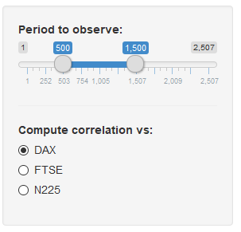

```{r setup, include=FALSE}
knitr::opts_chunk$set(echo = FALSE)
```
## Abstract

The application shows, for the decade 2007-2017, the correlation between the Dow Jones Industrial Index and three other major market indexes, namely:

* German DAX
* UK FTSE
* Japan Nikkei (N225)

You can run the application [here](https://spinwing.shinyapps.io/StockIndexCorrelation/)

The data has been extracted from Yahoo Finance using the _quantmod_ library and normalized to show the returns from the start of the period.

## The Data

```{r libraries, echo=FALSE, message=FALSE, warning=FALSE }
library(plotly)
library(quantmod)
```

```{r data, echo=FALSE, message=FALSE, warning=FALSE, cache=TRUE, include=FALSE}
# get symbols
getSymbols(c("^DJI", "^GDAXI", "^FTSE", "^N225"))
```

```{r chart, echo=FALSE, message=FALSE, warning=FALSE}
# merges close of day values
combo.xts <- merge.xts(Cl(DJI['2007-2017']), Cl(GDAXI['2007-2017']), Cl(FTSE['2007-2017']), Cl(N225['2007-2017']))
# removes incomplete cases
combo.xts <- combo.xts[complete.cases(combo.xts)]

# transforms in data frame
combo.zoo <- apply(combo.xts, 1, function(x) {x / combo.xts[1,]}) %>% t %>% as.xts
data <- data.frame(date=index(combo.zoo), coredata(combo.zoo))
colnames(data) = c("Date", "DJI", "DAX", "FTSE", "N225")

print(paste("Correlation between DJI vs DAX: ", cor(data$DJI, data$DAX)))
plot_ly(data, x = ~Date, y = ~DJI, name = 'DJI', type = 'scatter', mode = 'lines') %>%
  add_trace(y = ~DAX, name = 'DAX', mode = 'lines') %>%
  add_trace(y = ~FTSE, name = 'FTSE', mode = 'lines') %>%
  add_trace(y = ~N225, name = 'N225', mode = 'lines') %>%
  layout( xaxis = list(title="Date"), yaxis = list(title="Price"), title = "Major Market Indexes Returns - 2007-2017")
```


## The Application (1/2)

The application allows the user to specify the input parameters

On the left panel the user can specify the period interval and the index. 

  * The Interval can be selected by dragging the two cursors
  * The index can be selected by picking the Index of choice.


## The Application (2/3)

On the right panel the user can choose between two tabs:

* The Plot tab shows the chart for the given indexes-period
* The Table tab shows the data from the dataset for the selected period.
   


